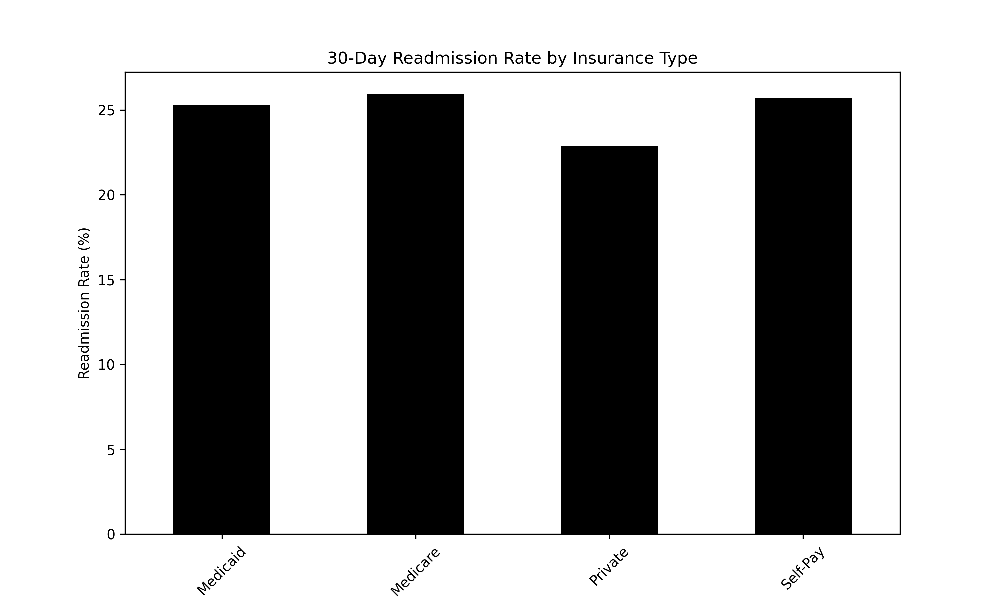
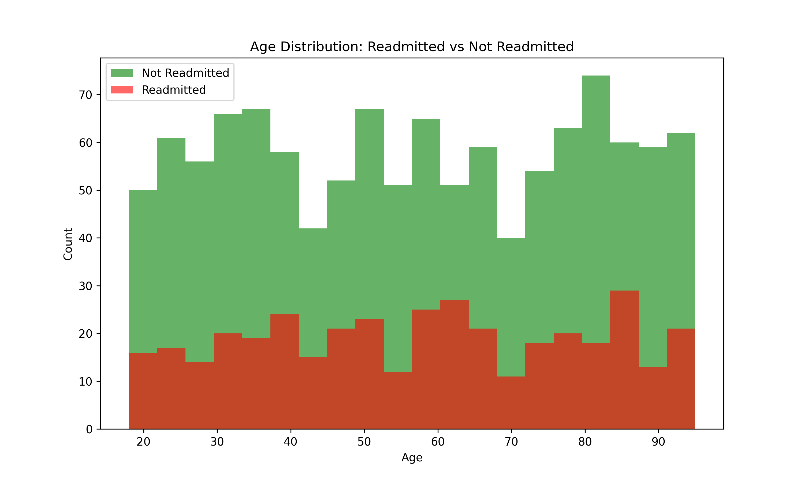

# Hospital Readmission Risk Analyzer Personal Project

A data science project related to healthcare, analyzing hospital readmission patterns using SQL and Python machine learning to predict which patients are at risk of being readmitted within 30 days of discharge. Hospital readmissions cost the US healthcare system lots of money. This project uses synthetic patient data to identify risk factors and build a predictive model for 30-day readmissions.

## 📊 Findings

**1541 admissions/records**
- **Overall Readmission Rate**: Around 25% of patients were readmitted within 30 days
- **Model Accuracy**: 69.6% accuracy in predicting readmissions
- **Top Risk Factors**: 
  - Age (34.9% importance) - Most important feature of the ones used
  - Number of medications (20.2% importance)
  - Length of stay (19.1% importance)
- **Insurance Impact**: Minimal variation in readmission rates across insurance types (24-26% for all)

## Technologies Used

- **Python**
- **SQL (SQLite)**
- **pandas**
- **scikit-learn**
- **matplotlib**

## 📊 Visualizations

### Readmission Rate by Insurance Type

### Age Distribution Comparison

